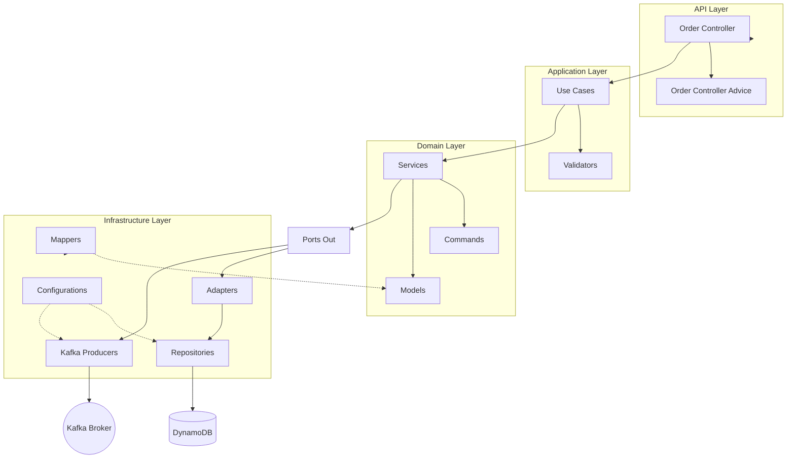
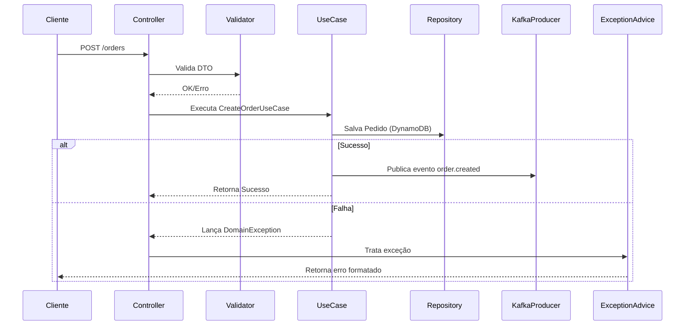
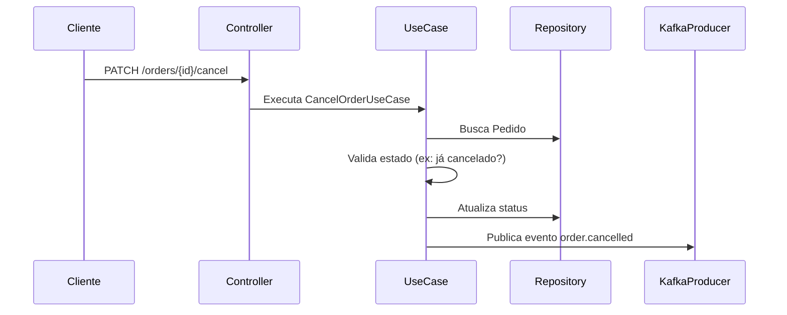
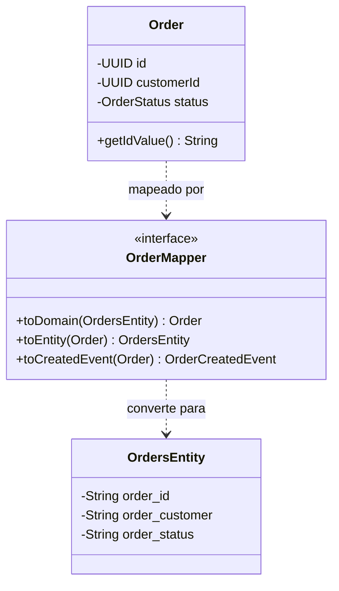

# Order Service Documentation

## 1. Visão Geral
O **Order Service** é um microsserviço voltado para o gerenciamento do ciclo de vida de pedidos em uma plataforma logística. Ele atua como um coordenador que valida, persiste e comunica o estado dos pedidos através de eventos assíncronos.

## 2. Arquitetura Detalhada
A aplicação utiliza uma estrutura baseada em camadas para garantir o desacoplamento entre a lógica de negócio (Domain), regras de aplicação (UseCases) e a infraestrutura técnica (Infrastructure).

## 3. Fluxos Principais com Tratamento de Erros

### Criação de Pedido (Order Creation)
O fluxo envolve validação de CEP via ViaCEP, persistência no DynamoDB e emissão de evento de criação.

### Cancelamento de Pedido (Order Cancellation)
Valida se o pedido existe e se pode ser cancelado.

## 4. Modelagem de Dados e Mapeamento
Existe uma separação clara entre o modelo de domínio (`Order`) e a entidade de persistência (`OrdersEntity`), intermediados por `OrderMapper` (MapStruct).

## 5. Componentes de Infraestrutura e Configuração

| Componente | Responsabilidade |
| :--- | :--- |
| `DynamoDbConfiguration` | Configuração do cliente AWS SDK v2 e Enhanced Client. |
| `KafkaConfiguration` | Configuração do `KafkaTemplate` e serializadores Avro. |
| `RestClientConfiguration` | Configuração do `RestClient` com `LoggingInterceptor` para APIs externas (ex: ViaCEP). |
| `CurrentTimeProvider` | Provedor de tempo (usado para gerar timestamps de eventos). |

## 6. API Endpoints
O serviço expõe os seguintes endpoints REST (v1):

| Método | Endpoint | Descrição |
| :--- | :--- | :--- |
| `POST` | `/orders` | Cria um novo pedido. |
| `PATCH` | `/orders/{id}/cancel` | Cancela um pedido existente. |

*Nota: A documentação completa da API (Swagger/OpenAPI) pode ser acessada em `/v1/docs/ui` quando a aplicação está rodando.*

## 7. Exceções e Tratamento
A aplicação centraliza o tratamento de erros em `OrderControllerAdvice`, capturando exceções específicas e mapeando para respostas HTTP apropriadas:
*   `DomainException` (e filhas como `InvalidStatusException`, `NonExistingOrderException`): Mapeadas para 400/404.
*   `InfrastructureException`: Mapeadas para 500 (problemas com AWS, Kafka, ViaCEP).

## 8. Estratégia de Testes
A suíte está estruturada para garantir qualidade em todas as camadas:

*   **Unitários:** `@ExtendWith(MockitoExtension.class)` para testar `UseCases`, `Services`, `Mappers` e `BaseKafkaProducer`.
*   **Integração:** `@SpringBootTest` com `Testcontainers` para `OrderRepository` (DynamoDB) e `Producers` (Kafka/SchemaRegistry).
*   **Contrato:** Validação de contratos Avro via `avro.avsc`.
*   **Qualidade:** PITest garantindo 100% de cobertura de mutação nos componentes críticos.
