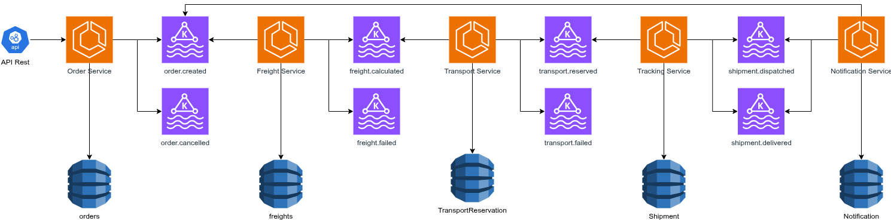

# logistics-event-platform (Spring + Kafka)



## 1. Introdução

### 1.1 Objetivo do documento

Este documento descreve os requisitos e a arquitetura de uma plataforma de logística orientada a eventos usando Spring Boot e Apache Kafka.

Ele serve como guia para:

- Desenvolvimento
- Testes
- Evolução da arquitetura
- Definição de eventos e contratos

### 1.2 Visão geral do sistema

O sistema gerencia o ciclo de um pedido de frete, da criação ao final da entrega. Cada serviço é independente e se comunica de forma assíncrona por meio de eventos Kafka.

### 1.3 Arquitetura

- Microserviços
- Comunicação assíncrona baseada em eventos
- Persistência por serviço (Database per Service)

---

## 2. Escopo do sistema

### 2.1 Serviços incluídos

1. Order Service
2. Freight Service
3. Transport Service
4. Tracking Service
5. Notification Service

### 2.2 Fora do escopo nesta versão

- Integração com sistemas externos reais
- Gateway de pagamento
- Interface gráfica avançada

---

## 3. Order Service

### 3.1 Responsabilidade

Gerenciar pedidos de frete e gerar eventos quando um pedido é criado ou cancelado.

### 3.2 Entidade Order

| Campo | Tipo | Descrição |
| --- | --- | --- |
| id | UUID | Identificador único do pedido |
| customerId | UUID | Identificador do cliente |
| origin | String | Origem do frete |
| destination | String | Destino do frete |
| weight | Decimal | Peso da carga |
| status | Enum | CREATED, CANCELLED |
| createdAt | Timestamp | Data de criação |

### 3.3 Base de dados

#### Relacional (PostgreSQL)

Motivos:

- Consistência forte
- Relacionamentos simples
- Consultas transacionais

#### Tabela principal

- `orders`

### 3.4 Tópicos Kafka

| Tópico | Tipo | Descrição |
| --- | --- | --- |
| order.created | Producer | Pedido criado |
| order.cancelled | Producer | Pedido cancelado |

### 3.5 Regras de negócio

1. O pedido só é criado se todos os dados obrigatórios estiverem preenchidos.
2. A criação de pedido publica o evento `order.created`.
3. Pedido cancelado não pode ser reativado.
4. Não é permitido editar o pedido após a criação.

---

## 4. Freight Service

### 4.1 Responsabilidade

Calcular o valor do frete com base nas informações do pedido.

### 4.2 Entidade Freight

| Campo | Tipo | Descrição |
| --- | --- | --- |
| id | UUID | Identificador do frete |
| orderId | UUID | Pedido associado |
| distanceKm | Decimal | Distância calculada |
| price | Decimal | Valor do frete |
| status | Enum | CALCULATED, FAILED |
| createdAt | Timestamp | Data de cálculo |

### 4.3 Base de dados

Relacional (PostgreSQL)

Motivos:

- Histórico financeiro
- Consistência de dados

### 4.4 Tópicos Kafka

| Tópico | Tipo | Descrição |
| --- | --- | --- |
| order.created | Consumer | Inicia cálculo de frete |
| freight.calculated | Producer | Frete calculado |
| freight.failed | Producer | Falha no cálculo |

### 4.5 Regras de negócio

1. Todo evento `order.created` deve resultar em um cálculo de frete.
2. O cálculo usa peso e distância.
3. Se houver falha, publica `freight.failed`.
4. O processo deve ser idempotente por `orderId`.

---

## 5. Transport Service

### 5.1 Responsabilidade

Reservar transporte e motorista a partir do frete calculado.

### 5.2 Entidade TransportReservation

| Campo | Tipo | Descrição |
| --- | --- | --- |
| id | UUID | Identificador da reserva |
| orderId | UUID | Pedido associado |
| vehicleId | String | Veículo reservado |
| driverName | String | Motorista |
| status | Enum | RESERVED, FAILED |
| reservedAt | Timestamp | Data da reserva |

### 5.3 Base de dados

#### Não relacional (MongoDB)

Motivos:

- Estrutura flexível
- Facilita futuras integrações de frota

### 5.4 Tópicos Kafka

| Tópico | Tipo | Descrição |
| --- | --- | --- |
| freight.calculated | Consumer | Inicia reserva de transporte |
| transport.reserved | Producer | Reserva confirmada |
| transport.failed | Producer | Falha na reserva |

### 5.5 Regras de negócio

1. Transportes são reservados somente após o frete ser calculado.
2. Cada pedido tem, no máximo, uma reserva.
3. Falhas devem ser comunicadas por evento.

---

## 6. Tracking Service

### 6.1 Responsabilidade

Acompanhar o andamento do envio desde a reserva até a entrega.

### 6.2 Entidade Shipment

| Campo | Tipo | Descrição |
| --- | --- | --- |
| id | UUID | Identificador do envio |
| orderId | UUID | Pedido associado |
| status | Enum | DISPATCHED, IN_TRANSIT, DELIVERED |
| updatedAt | Timestamp | Última atualização |

### 6.3 Base de dados

Não relacional (MongoDB)

Motivos:

- Atualizações frequentes
- Estrutura simples

### 6.4 Tópicos Kafka

| Tópico | Tipo | Descrição |
| --- | --- | --- |
| transport.reserved | Consumer | Cria o envio |
| shipment.dispatched | Producer | Envio iniciado |
| shipment.delivered | Producer | Envio entregue |

### 6.5 Regras de negócio

1. Envio só existe após transporte reservado.
2. Status evolui em sequência.
3. Não é permitido voltar para um status anterior.

---

## 7. Notification Service

### 7.1 Responsabilidade

Enviar notificações aos clientes sobre eventos importantes.

### 7.2 Entidade Notification

| Campo | Tipo | Descrição |
| --- | --- | --- |
| id | UUID | Identificador |
| orderId | UUID | Pedido |
| type | Enum | EMAIL, SMS |
| message | String | Conteúdo da mensagem |
| sentAt | Timestamp | Horário do envio |

### 7.3 Base de dados

Não relacional (MongoDB)

Motivos:

- Armazenar logs de notificação

### 7.4 Tópicos Kafka

| Tópico | Tipo |
| --- | --- |
| order.created | Consumer |
| shipment.dispatched | Consumer |
| shipment.delivered | Consumer |

### 7.5 Regras de negócio

1. Cada entrega gera uma notificação.
2. Falha na notificação não interrompe o fluxo principal.

---

## 8. Considerações técnicas gerais

- Chave Kafka padrão: `orderId`
- Garantia de ordenação por pedido
- Retry e Dead Letter Topic ativados
- Observabilidade obrigatória

---

## 9. Conclusão

Este documento descreve uma base clara para implementar uma plataforma logística orientada a eventos, com regras de negócio, eventos bem definidos e arquitetura preparada para evolução.

---

## Padrões gerais de eventos

Todos os eventos seguem estas regras:

- Evento é um fato imutável
- Chave Kafka: `orderId`
- Versão explícita
- Sem dados internos do banco
- Timestamp de ocorrência

### Campos comuns do evento

```json
{
  "eventId": "uuid",
  "eventType": "string",
  "eventVersion": 1,
  "occurredAt": "ISO-8601"
}
```

Esses campos podem estar:

- no payload, ou
- nos headers do Kafka (mais avançado)

Aqui usamos payload para deixar mais claro.
